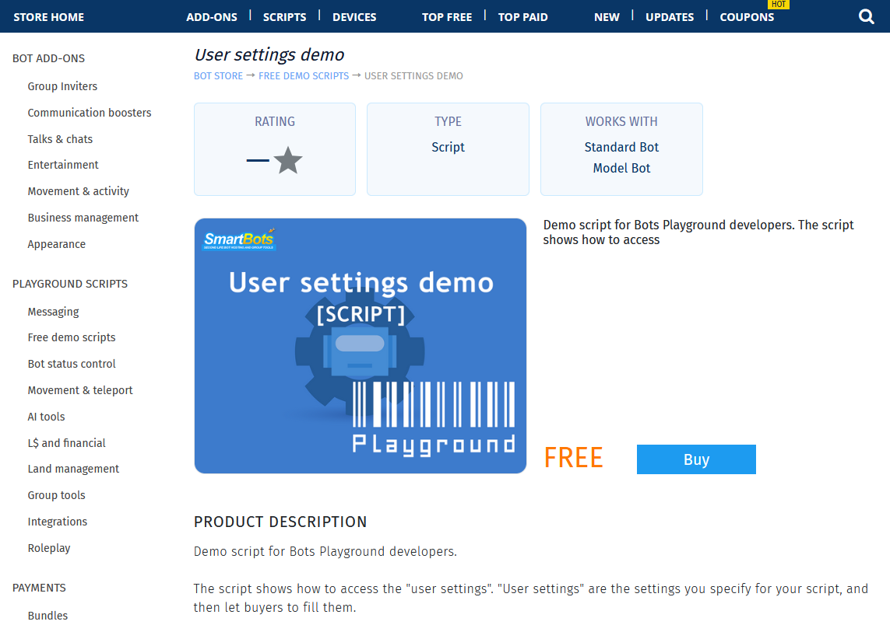
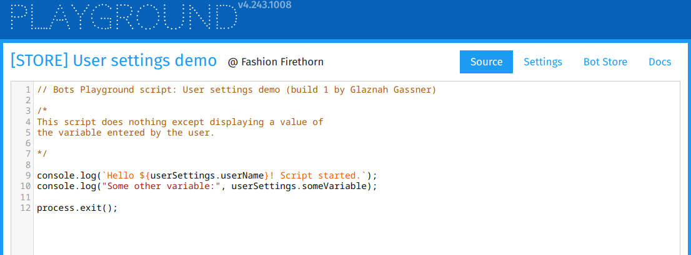

# Store

Scripts written for [Bot Playground](./../Bots%20Playground.md) can be sold on the [SmartBots Bot Store](https://www.mysmartbots.com/store/section/scripts/).

You set the price, name, and description of your script — or choose to distribute it for free.\nPayments from sales go directly to your SmartBots Wallet.

# Script in Store

One of the demo scripts available in the Store looks like this:

 

With the following source code inside the Playground:

 

After purchasing, the script buyer attaches it to their bot, configures the required settings, and runs it.

# What to Know

Learn the following topics to understand how to sell and manage scripts effectively:

* [Publishing script to Store](./Store/Publishing.md)
* [User settings](./Store/User%20settings.md)
* [Releases](./Store/Releases.md)
* [Payments](./Store/Payments.md)