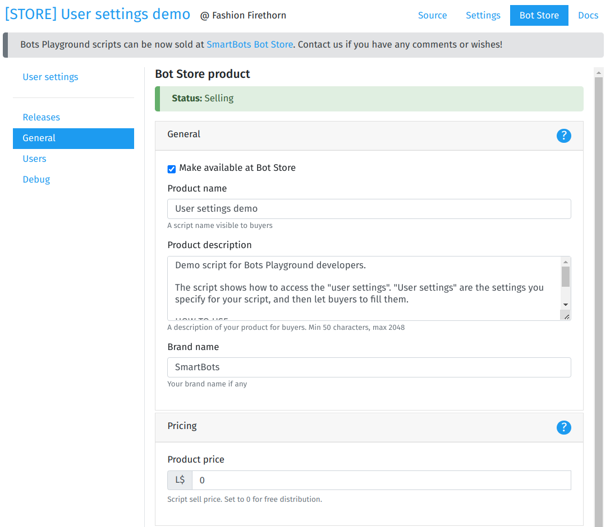
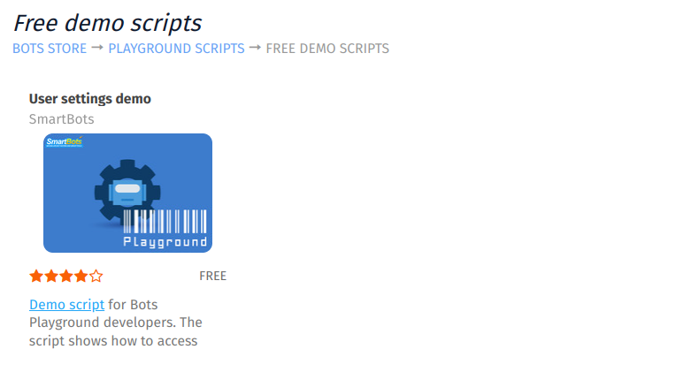

# Publishing

Publishing your script to the SmartBots Bot Store makes it available for others to browse and purchase.

# How to publish

A checklist to publish your script:

1. Make a script ready (written and tested)
2. Set up user settings if your script needs any
3. Create a release
4. Prepare a public script name, description, and price

 

# Script Store details

* **Product name** – the name your users will see in the Store.
* **Description** – the script description. Try to keep it detailed and informative.
* **Brand name** – optional, helps distinguish your script among others.
* **Price** – the price of your product.
* **Open sources** – allows you to show the script's source code to buyers if desired.
* **Support contact info** – the way for buyers to reach support. This can include Second Life names, email, Discord name, or any other method.

# Publication status

You can hide your product from the Store at any time, and make it visible again whenever you want.

# Script content moderation

All changes to the product details are subject to moderation by the Store team. Your script may become available immediately or may be temporarily suspended until the moderation team approves it.

The SmartBots moderation team does **not** check or access the script code. Only the Store's public details are verified.

# Script rate (stars)

Store scripts receive user ratings displayed as stars:

 

Users who purchase the script can rate it directly in Playground:

 Note that the script creator's own rating does not count toward the total script rating.