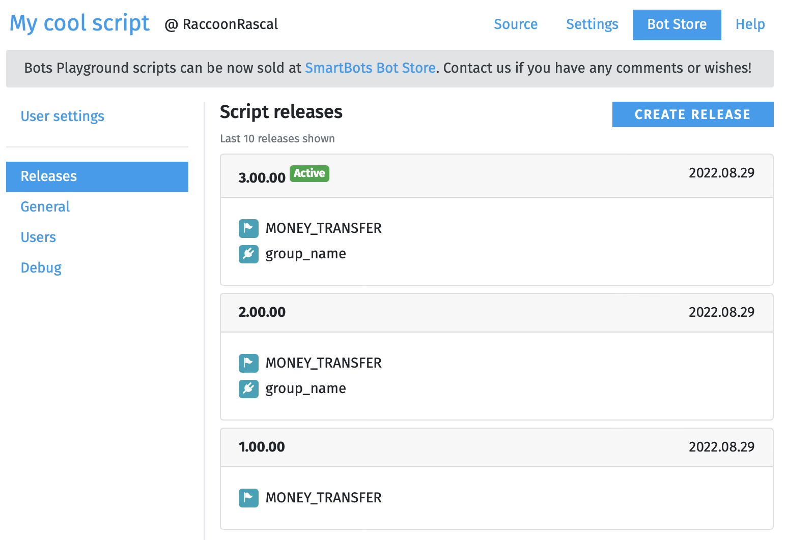

# Releases

When you sell your script at Bot Store, you sell a specific release. Consider it a "script version".

At least one (first) release is required. However, you may want to update, bug-fix, and improve your already existing script. To do this, you continue the script's development and eventually create a new release.

 Each release has the following information associated with it:

* Release version
* Internal name (only visible to you)
* Public details (for example, the list of bugs fixed)
* Script permissions ([read more about permissions](./Permissions.md))
* User settings ([read more about user settings](./User%20settings.md))

# Release version

The release version consists of three parts (`00.00.000`) — major version, minor version, and build number. You can increase them in any way you prefer. The only requirement is that the version number of a new release must be greater than that of the previous one.

There is no way to roll back a release. Instead, you create a new one.

# Existing script users

Once you publish a script update, each user (buyer) of your script will receive an invitation to install the update.