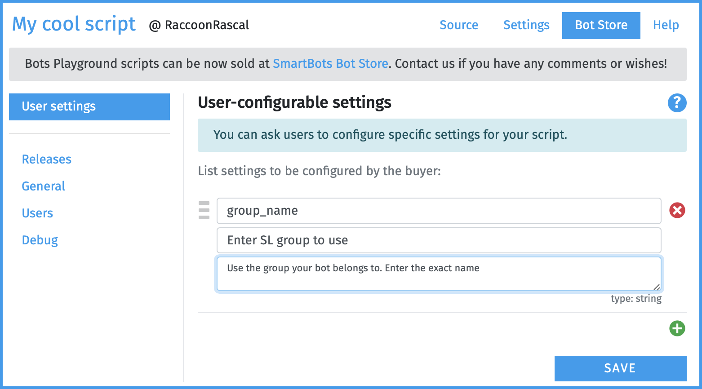
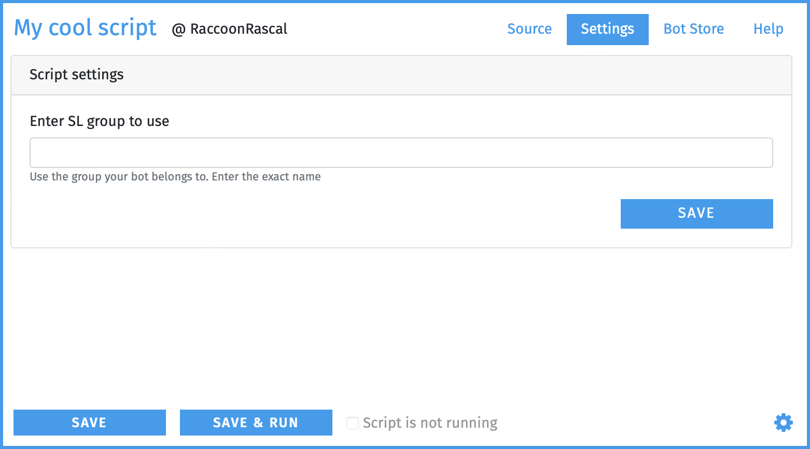
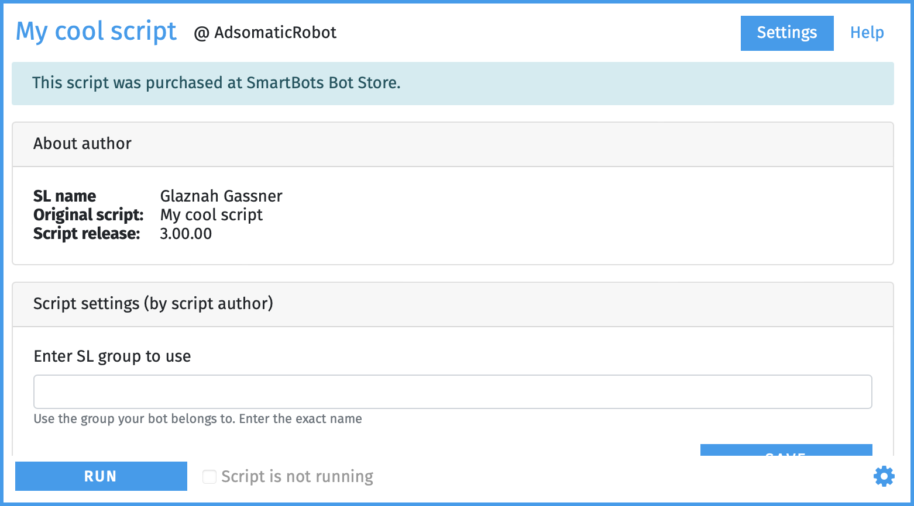
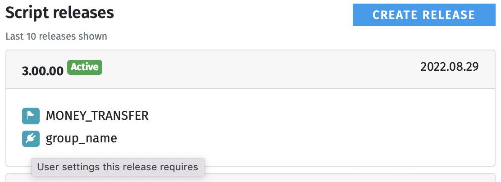

# User settings

# Script User Settings

Most scripts are designed to be **configurable** by the user. These configurable options can include things like group names, custom messages, and other parameters.


:::info
**Note:** The user's **bot name** is not a setting. The user selects which bot to use when purchasing your script.

:::

# Configuring Settings

 

When defining user settings, you specify three values:


1. **Variable name** — how your script references the setting.
2. **Friendly name** — how the setting appears to the user.
3. **Optional hint** — a short description to help the user.


:::warning
All settings are stored as string values. If you need a number or UUID, you should convert it appropriately within your script.

:::

# Accessing User Settings from Script

User settings can be accessed via the global `userSettings` object:

```javascript
console.log("Using group: " + userSettings.group_name);
```

## Example: Setting Defaults

An easy way to define default values is by using `Object.assign()`.

```javascript
// Define the default settings here.
const defaultSettings = {
  greetingMessage: "Hello, welcome!",
  repeatCount: 2,
  enableLogging: false
};

// Merge defaults with any values provided by the user.
const settings = Object.assign({}, defaultSettings, userSettings);

// Access the settings.
console.log(settings.greetingMessage);
```

# Specifying Settings While Developing Scripts

While developing your script, you can specify custom test values for user settings on the **Settings** tab:

 

New settings will automatically appear here after you add them on the **Bot Store → User Settings** screen.

# Asking the User for Settings

After purchasing the script, users see a configuration panel for their settings:

 

# Settings and Releases

When you publish a new release, the list of settings is saved with that release. This means future changes to user settings won't affect existing script versions:\n

 


\

\

\
You can safely rename, add, or remove settings when updating your script — previously purchased versions will continue to function normally.